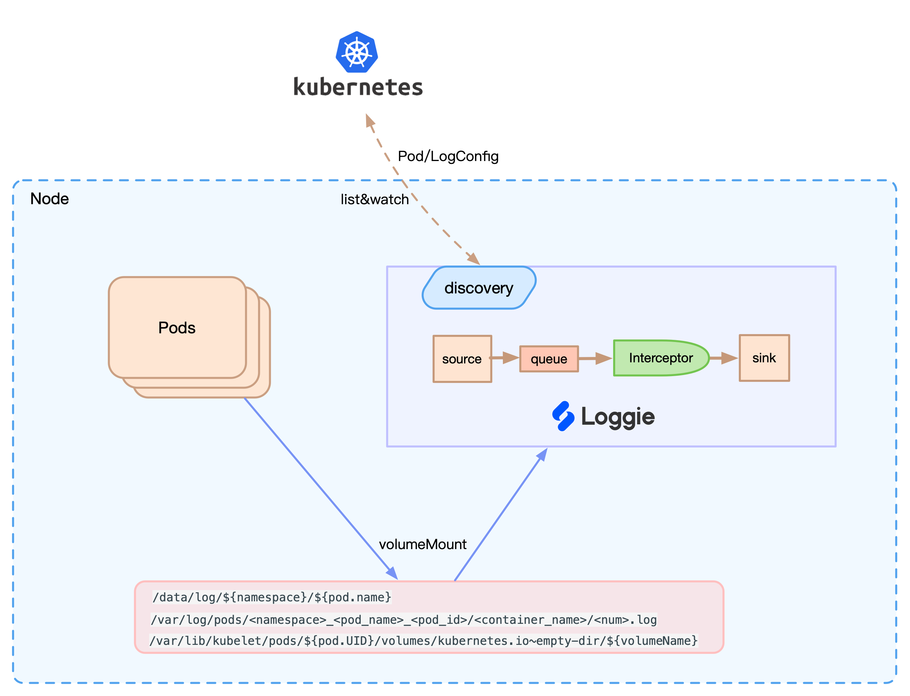

# 使用Loggie采集容器日志

阅读本文之前，建议先参考[Kubernetes下日志采集](general-usage.md)问题。 

## Loggie如何采集容器日志？
由于Kubernetes良好的可扩展性，Kubernetes设计了一种自定义资源CRD的概念，用户可以自己定义CRD表示自己的期望状态，并借助一些framework开发Controller，使用Controller将我们的期望变成现实。  

基于这个思路，一个服务需要采集哪些日志，需要什么样的日志配置，是用户的期望，而这就需要我们开发一个日志采集的Controller去实现。  

所以，用户只需要在我们定义的CRD LogConfig中，填写需要采集哪些Pods的日志，在Pod中的日志路径是什么。  

核心架构如下图所示：



Loggie会感知到Pod和CRD的事件，进行配置的动态更新。同时，Loggie可以根据日志文件路径挂载的Volume，找到相应在节点的文件进行采集。另外还可以根据配置，自动将Pod上的Env/Annotation/Label加入到日志里作为元信息。  

同时相比粗暴的所有节点挂载相同路径进行通配采集的方式，也解决了没法针对单个服务精细化配置、采集无关日志的问题。  

当然带来的好处不仅仅这些，Loggie在动态配置下发、监控指标等方面都可以基于Kubernetes进行相应的适配和支持。  

## CRD使用说明
Loggie目前有以下几种CRD：

- **[LogConfig](../../reference/discovery/kubernetes/logconfig.md)**：namespace级别CRD，用于采集Pod容器日志，其中主要填写采集的source配置，以及关联的sink和interceptor。
- **[ClusterLogConfig](../../reference/discovery/kubernetes/clusterlogconfig.md)**：cluster级别CRD，表示集群级别的采集Pod容器日志，采集Node节点上的日志，以及为某个Loggie集群下发通用的pipeline配置。
- **[Sink](../../reference/discovery/kubernetes/sink.md)**：表示一个sink后端，需要在ClusterLogConfig/LogConfig中被关联。
- **[Interceptor](../../reference/discovery/kubernetes/interceptors.md)**：表示一个interceptors组，需要在ClusterLogConfig/LogConfig中被关联。

使用CRD的流程架构如下所示：


## 准备工作

### 部署架构
**整体的部署架构是什么？**

1. Loggie Agent直接发送给后端比如Elasticsearch还是其他存储等  
2. Loggie Agent发送至Loggie Aggregator中转处理，再转发至其他后端存储  
3. Loggie Agent发送至Kafka，Loggie Aggregator消费Kafka再发送至后端   
...

本文仅关注采集端，如果需要使用部署Loggie Aggregator，请参考[Loggie中转机](../best-practice/aggregator.md)。

在采集容器日志之前，请确保已经在Kubernetes中部署了Loggie DaemonSet。[如何在Kubernetes中部署Loggie？](../../getting-started/install/kubernetes.md)  

!!! info 
    我们推荐使用DaemonSet的方式采集容器日志，后续Loggie计划支持自动注入Loggie Sidecar的方式采集日志。[RoadMap](../../getting-started/roadmap/roadmap-2022.md)


### 使用方式
**业务Pod使用什么方式挂载日志？**     
建议如果对日志可能性的丢失不敏感，比如运维类的日志，可以使用emptyDir。如果日志比较重要，不允许丢失，请使用hostPath，并在volumeMount配置subPathExpr实现路径隔离。

!!! example
    === "tomcat-emptydir.yml"

        ```yaml
        apiVersion: apps/v1
        kind: Deployment
        metadata:
          labels:
            app: tomcat
          name: tomcat
          namespace: default
        spec:
          replicas: 1
          selector:
            matchLabels:
              app: tomcat
          template:
            metadata:
              labels:
                app: tomcat
            spec:
              containers:
              - name: tomcat
                image: tomcat
                volumeMounts:
                - mountPath: /usr/local/tomcat/logs
                  name: log
              volumes:
              - emptyDir: {}
                name: log        
        ```

    === "tomcat-hostpath.yml"

        ```yaml
        apiVersion: apps/v1
        kind: Deployment
        metadata:
          labels:
            app: nginx
          name: nginx
          namespace: default
        spec:
          replicas: 1
          selector:
            matchLabels:
              app: nginx
          template:
            metadata:
              labels:
                app: nginx
            spec:
              containers:
              - env:
                - name: POD_NAME
                  valueFrom:
                    fieldRef:
                      apiVersion: v1
                      fieldPath: metadata.name
                - name: NAMESPACE
                  valueFrom:
                    fieldRef:
                      apiVersion: v1
                      fieldPath: metadata.namespace
                image: nginx
                name: nginx
                volumeMounts:
                - mountPath: /log
                  name: datalog
                  subPathExpr: $(NAMESPACE)/$(POD_NAME)
              volumes:
              - hostPath:
                  path: /data/log
                  type: ""
                name: datalog
        ```

!!! caution
    请确保Pod挂载的日志路径不会被多个Pod共享。比如一个Deployment下的两个Pod，使用未配置subPathExpr的hostPath挂载日志目录，如果两个Pod调度在相同的节点，会打印到相同的日志目录和文件中，此时可能引起采集异常。

我们首先创建以上示例的tomcat Deployment作为我们被采集日志的对象。
```
kubectl apply -f tomcat-emptydir.yml
```

接下来将演示采集上面示例的tomcat日志，并发送至Elasticsearch。  
如果你希望采集其他的容器日志，或者发送至其他的后端，只需要修改其中的配置即可。  

### 部署Elasticsearch和Kibana（可选）
由于本文演示发送至Elasticsearch，所以这里我们部署一下Elasticsearch和Kibana。  
如果你的环境中已经有Elasticsearch和Kibana，这一步可以忽略。  
如果希望自己搭建一套Elasticsearch和Kibana试用，这里建议：

- [使用Helm部署Elasticsearch](https://github.com/elastic/helm-charts/blob/main/elasticsearch/README.md)
- [使用Helm部署Kibana](https://github.com/elastic/helm-charts/tree/main/kibana)

如果本地没有helm客户端，需要下载[helm](https://helm.sh/docs/intro/install/)。  

使用如下命令:
```shell
helm repo add elastic https://helm.elastic.co
helm install elasticsearch elastic/elasticsearch --set replicas=1
helm install kibana elastic/kibana
```

通过：

```shell
kubectl port-forward service/kibana-kibana 5601:http
```

可以直接在浏览器输入[localhost:5601](localhost:5601)，访问Kibana页面。


## 采集容器日志

### 创建sink
为了表明我们即将采集日志发送到的Elasticsearch，需要配置对应的Sink。  
这里有两种方式：  

1. 如果整个集群只会有一个存储后端，我们可以在全局的配置文件configMap里，配置defaults参数，具体可[参考](../../reference/global/defaults.md)。

2. 使用Sink CRD，并在logConfig中引用。这种方式可以扩展为多个后端，不同的logConfig可以配置使用不同的后端存储，大多数情况下，我们建议使用该方式。  

创建一个Sink如下，Sink为集群级别CRD。可以在spec.sink中修改为其他配置。  
!!! example

    ```yaml
    cat << EOF | kubectl apply -f -
    apiVersion: loggie.io/v1beta1
    kind: Sink
    metadata:
      name: default
    spec:
      sink: |
        type: elasticsearch
        index: "loggie"
        hosts: ["elasticsearch-master.default.svc:9200"]
    EOF
    ```

可以通过`kubectl get sink default`查看是否创建成功。

### 创建interceptor(可选)
和Sink一样，配置interceptor有两种方式：  

1. 在全局配置文件configMap中，配置defaults参数。此时意味着所有的Loggie Agent都使用该default interceptors配置。   

2. 使用Interceptor CRD，并在logConfig中被引用。这种方式会更加灵活，适合有一定运维和功能需求的场景。  

Loggie目前默认内置了`metric`（监控指标发送）、 `maxbytes`（最大event字节数限制）、 `retry`（重试）三个interceptors。即使我们没有使用以上两种方式配置，仍然会自动使用这3个默认interceptor，所以interceptor其实是可选项。    

!!! caution
    - 在全局的defaults中，配置interceptors，会覆盖掉现有的内置interceptors，所以如果使用全局defaults配置interceptors，请把内置的interceptors都加上，除非你确定不需要。  
    - 使用interceptor CRD配置的logConfig，不会覆盖默认和内置的interceptors，会通过新增的方式加入整个pipeline interceptors chain。  

创建一个interceptor示例如下：  
!!! example

    ```yaml
    cat << EOF | kubectl apply -f -
    apiVersion: loggie.io/v1beta1
    kind: Interceptor
    metadata:
      name: default
    spec:
      interceptors: |
        - type: rateLimit
          qps: 90000
    EOF
    ```

这里我们创建了一个`rateLimit` interceptor，可用于采集发送日志的限流。  
可以通过`kubectl get interceptor default`或者`kubectl get icp default`查看是否创建成功。  

### 创建logConfig
创建完sink和interceptor后，最重要的便是创建logConfig，表明我们希望采集哪些Pod的日志，以及采集Pod的哪些日志。  

logConfig里spec.selector部分表示日志配置的下发范围，对采集Pod日志来说，需要配置`type: pod`，并且使用`labelSelector`选择指定的Pods，即采集这些Pods的日志。  
示例如下：  
```yaml
spec:
  selector:
    type: pod
    labelSelector:
      app: tomcat
```

另外，我们需要在pipeline.sources中配置file source，即采集Pods的哪些日志。  
```yaml
  pipeline:
    sources: |
      - type: file
        name: mylog
        paths:
          - stdout
          - /var/log/*.log
```
需要注意的是：  

- path里填`stdout`，表示采集容器的标准输出路径。
- path里填写的日志文件，是容器里的路径。（最终生成配置的时候，Loggie会自动更新成节点上的路径，无需用户关心）  
- path请使用glob表达式填写。  
- 当`type: pod`时，pipeline.name会被loggie自动按照`${namespace}-${logConfigName}`的格式生成，所以这里无需填写。  
- 最终生成的source.name会按照`${podName}-${containerName}-${sourceName}`格式生成。  

最后，我们使用sinkRef和interceptorRef引用上面创建的sink和interceptor。  
最终创建一个logConfig示例如下：  
!!! example

    ```yaml
    cat << EOF | kubectl apply -f -
    apiVersion: loggie.io/v1beta1
    kind: LogConfig
    metadata:
      name: tomcat
      namespace: default
    spec:
      selector:
        type: pod
        labelSelector:
          app: tomcat
      pipeline:
        sources: |
          - type: file
            name: common
            paths:
              - stdout
              - /usr/local/tomcat/logs/*.log
        sinkRef: default
        interceptorRef: default
    EOF
    ```

我们可以通过`kubectl get logconfig tomcat`或者`kubectl get lgc tomcat`来查看是否创建成功。  
同时可以通过`kubectl describe lgc tomcat`查看logConfig的events，用于排查状态。  
如果有以下类似的events，说明配置已经下发成功。  
```
Events:
  Type    Reason       Age   From                       Message
  ----    ------       ----  ----                       -------
  Normal  syncSuccess  55s   loggie/kind-control-plane  Sync type pod [tomcat-684c698b66-hvztn] success
```

我们还可以通过`kubectl -nloggie logs -f ${loggie-name}`来查看指定节点Loggie的日志来判断日志采集情况。  

发送成功后，我们可以在Kibana上查询到采集到的日志。  


